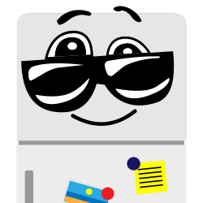

# Zevere

Simple Task Management Solution. Offers ToDo lists and reminders that you enjoy to __develop__ and __use__.

## Overview

Zevere is more than a ToDo list or a reminder app. The idea of a task manager app is simple and easy to understand. This makes it a good platform to build on top of.

Build what? Whatever you wish to learn or get experience of and fits into the picture!

Zevere project started so its contributors learn new technologies and overcome challenges in implementing such solutions.

## Road map

There are many crazy ideas that you can try in such a humble system. We want to be as close as possible to a distributed-systems architecture. That way new services/nodes/replicas could be deployed with no down-time.

We keep throwing new ideas in so we get a chance to code/test/configure/deploy something new.

There are no biases on the the language/framework/tool to get the job done. Anything is permitted as long as it might/could/would work with the system in place. Also, each service, such as a Web API, could have multiple implementations using let's say F#, Ruby, and Go. All of them should work in parallel without breaking anything.

Here are some of them listed:

- RESTful web API
- Multiple implementations for Data Access layer
    - SQLite
    - Cassandra
    - Postgres XL
- IdentityServer
- Presentation layer projects
    - Angular SPA
    - Telegram bot
    - ReactJS SPA
    - Xamarin native mobile apps
    - UWP Windows app
    - Electron desktop apps
- Micro services on Docker containers
- Deployment orchestration with Kubernetes
- Kafka
- Logging
    - SeriLog
    - ELK stack
- Big Data
    - Hadoop
- Chat bots on more platforms
- Voice enable bots
- IoT

## Contributions

All contributions are welcome. **Come code/test/configure/deploy with us!** You can easily ask to join as a collaborator, just let us know the thing(s) you would like to work on.

Collaborators must be a member of the group chat to ensure that they know what's happening with the project.

### Why contribute

- Learn a new tech you always wanted to learn quickly
- You enjoy working with great people here
- Your work gets peer reviewed and possibly improved
